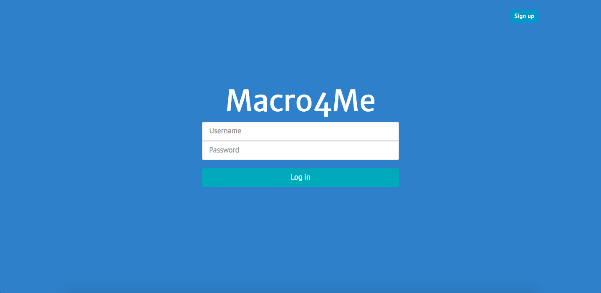
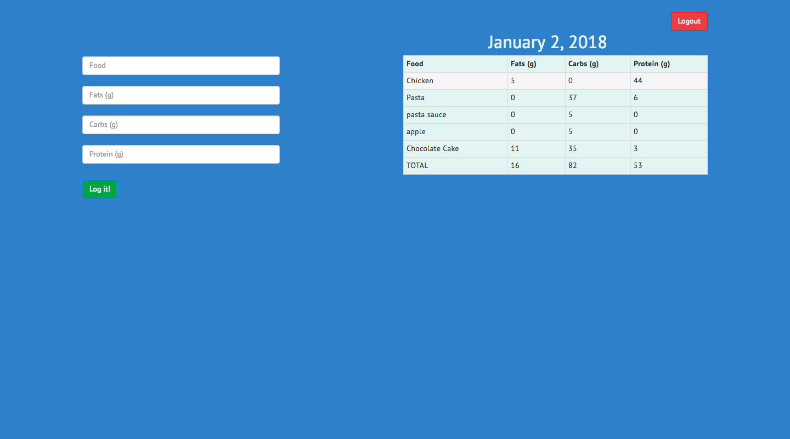

# Macro4Me

[Live link][heroku]

[heroku]: https://macro4me.herokuapp.com/#/login

Macro4Me is a single page web application which allows users to log their foods along with their macronutrients to better track their daily macronutrients.

## Features

### User Authentication

On first entering Macro4Me, you will be prompted to either Login or Create a New Account. The authentication utilizes a Protected Route that ensures users who attempt to access the inners of Macro4Me are re-routed to the Login page.

### Home

A very simple and clean interface that allows you to enter the food and its macros on the left, and displaying it on the right. The log resets every midnight.

#### Signup

On creation of an account, The username and password is taken in via the session form and sent to the backend. The password is then hashed using the BCrypt gem and saved as the password digest.

#### Login and Logout

Data is taken in via the session form and received in the backend where the username is checked via the database, and the password is hashed and checked against the password digest.

If the user is found in the database and the password is correct, a session token is generated using Base64. On Logout, the user's session token is set to null, and the database resets the session token.

### Get Started

1. Install dependencies by running `npm install` followed by `bundle install`
2. Macro4Me uses PostgreSQL. Start your database by running `bundle exec rake db:setup`.
3. Start your server by running `bundle exec rails server`

### Coming Soon To a Macro4Me Near You

1. Calories
2. Profile to track weight. Weight will be shown on a graph which utilizes the d3 library.
